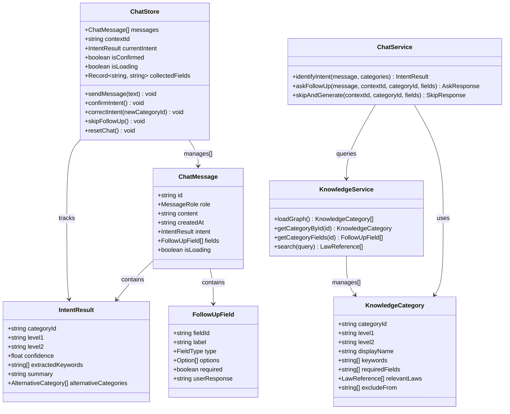
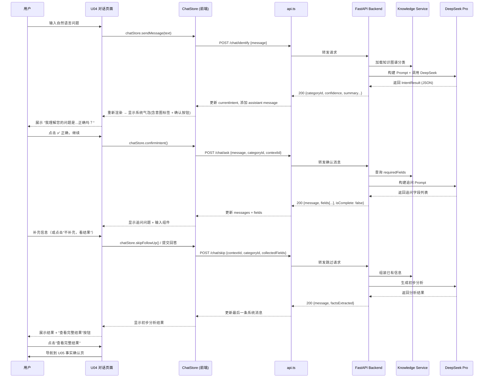
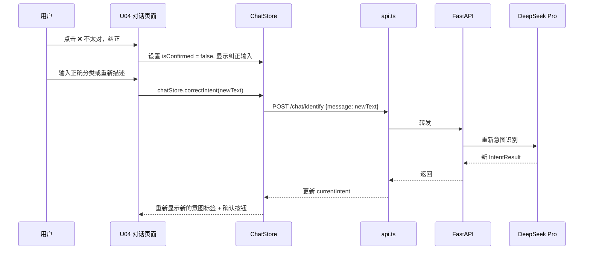
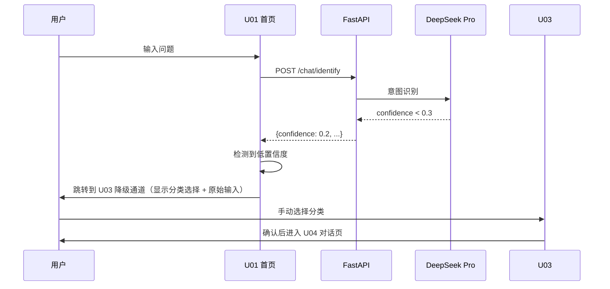
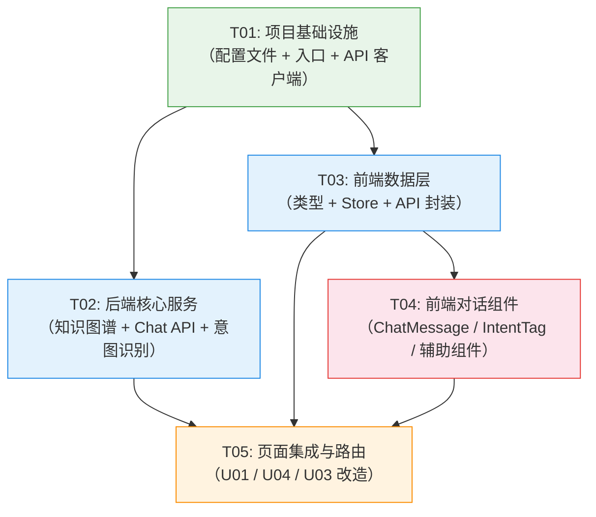

# 架构设计文档：Legal AI Lab 交互逻辑重构

> - **版本**: v1.0
> - **日期**: 2026-07-28
> - **作者**: 高见远 (架构师)
> - **范围**: Phase 1（知识图谱 + API 集成 + 意图识别）+ Phase 2（对话式 UI）

---

## Part A: 系统设计

### 1. 实现方案

#### 1.1 核心技术挑战

| 挑战 | 说明 | 应对策略 |
|------|------|----------|
| 意图分类精确性 | "合同不续签"不能归到"欠薪" | 知识图谱驱动的 few-shot Prompt + 严格互斥规则 |
| 多轮对话状态管理 | 对话式咨询需要维持上下文 | 前端 Zustand store + 后端上下文 ID |
| 按需追问逻辑 | 不同分类只需问不同字段 | 图谱中预定义 requiredFields，动态生成追问 |
| LLM 响应速度 | 用户期望 3 秒内得到意图识别 | 流式输出 + 前端 TypingIndicator |
| 新旧流程兼容 | U04 旧表单保留为备选 | 页面保持路由，新增对话模式作为默认 |

#### 1.2 框架与库选型

| 层 | 技术选型 | 理由 |
|---|---------|------|
| **后端框架** | FastAPI（已有） | 异步支持好、类型安全、已有项目基础 |
| **LLM 客户端** | `httpx`（已有依赖） | 直接调用 DeepSeek API，无需额外 SDK |
| **知识图谱存储** | JSON 文件（`data/knowledge/knowledge_graph.json`） | 简单可维护、零依赖、人工可编辑 |
| **向量检索（P1）** | 预留接口，暂不实现 | 先走通基础流程，P1 再引入 pgvector |
| **前端框架** | Next.js 16（已有） | 服务端组件 + 客户端组件混合 |
| **状态管理** | Zustand（已有） | 已有 persist 中间件，加 chatStore 即可 |
| **UI 组件** | Tailwind CSS v4（已有） | 无需额外 UI 库，所有组件自实现 |
| **消息 ID** | `uuid` 或 `crypto.randomUUID()` | 前端生成，保证消息唯一性 |

#### 1.3 架构模式

```
┌──────────────────────────────────────────────────────────┐
│                  前端 (Next.js 16)                        │
│  ┌──────────┐  ┌───────────┐  ┌──────────────────────┐  │
│  │ U01 首页 │  │ U04 对话  │  │ U03 降级通道         │  │
│  │ (入口)   │  │ (核心)    │  │ (低置信度兜底)       │  │
│  └────┬─────┘  └─────┬─────┘  └──────────┬───────────┘  │
│       │              │                    │              │
│  ┌────┴──────────────┴────────────────────┴───────────┐  │
│  │              Frontend Data Layer                    │  │
│  │  ┌──────────────┐  ┌──────────────┐                │  │
│  │  │ types.ts     │  │ chatStore.ts │                │  │
│  │  │ (新增类型)   │  │ (对话状态)   │                │  │
│  │  └──────────────┘  └──────────────┘                │  │
│  │  ┌──────────────┐                                  │  │
│  │  │ api.ts       │  ← fetch/axios 封装              │  │
│  │  └──────────────┘                                  │  │
│  └────────────────────────────────────────────────────┘  │
│                    │ HTTP POST                            │
└────────────────────┼─────────────────────────────────────┘
                     │
┌────────────────────┼─────────────────────────────────────┐
│                  后端 (FastAPI)                           │
│  ┌────────────────┴────────────────────────────────────┐  │
│  │  /api/v1/chat/identify     → 意图识别               │  │
│  │  /api/v1/chat/ask          → 对话/追问              │  │
│  │  /api/v1/chat/skip         → 跳过追问               │  │
│  │  /api/v1/knowledge/...     → 知识图谱查询           │  │
│  └─────────────────────────────────────────────────────┘  │
│                           │                                │
│  ┌────────────────────────┴────────────────────────────┐  │
│  │                Service Layer                         │  │
│  │  ┌────────────────┐  ┌──────────────────────────┐   │  │
│  │  │ chat_service   │  │ knowledge_service        │   │  │
│  │  │ (LLM 调用)     │  │ (图谱加载与查询)         │   │  │
│  │  └───────┬────────┘  └──────────────────────────┘   │  │
│  │          │                                           │  │
│  │  ┌───────┴────────┐                                 │  │
│  │  │ chat_prompts   │  ← Prompt 模板                  │  │
│  │  │ (few-shot)     │                                 │  │
│  │  └────────────────┘                                 │  │
│  └─────────────────────────────────────────────────────┘  │
│           │ HTTP POST                                      │
└───────────┼────────────────────────────────────────────────┘
            │
┌───────────┴────────────────────────────────────────────────┐
│              DeepSeek Pro API                              │
│              https://api.deepseek.com/v1/chat/completions  │
└────────────────────────────────────────────────────────────┘
```

---

### 2. 文件列表

#### 2.1 新增文件

| 序号 | 相对路径 | 说明 |
|:----:|----------|------|
| 1 | `data/knowledge/knowledge_graph.json` | 劳动法知识图谱数据（36 个二级分类节点） |
| 2 | `app/routers/chat.py` | Chat 路由：identify / ask / skip |
| 3 | `app/routers/knowledge.py` | Knowledge 路由：categories / search |
| 4 | `app/services/chat_service.py` | Chat Service：DeepSeek API ��用封装 |
| 5 | `app/services/knowledge_service.py` | Knowledge Service：图谱加载与查询 |
| 6 | `app/services/chat_prompts.py` | Prompt 模板：System Prompt + Few-shot |
| 7 | `app/schemas/chat.py` | Chat 相关 Pydantic Schema |
| 8 | `frontend/src/lib/api.ts` | 前端 API 客户端 |
| 9 | `frontend/src/lib/chatStore.ts` | 对话状态 Store（Zustand） |
| 10 | `frontend/src/components/chat/ChatMessage.tsx` | 通用聊天消息组件 |
| 11 | `frontend/src/components/chat/IntentTag.tsx` | 意图分类标签组件 |
| 12 | `frontend/src/components/chat/ContextSummary.tsx` | 对话上下文摘要卡片 |
| 13 | `frontend/src/components/chat/SkipButton.tsx` | "不补充，直接看结果"按钮 |
| 14 | `frontend/src/components/chat/TypingIndicator.tsx` | 打字状态动画 |
| 15 | `frontend/src/components/chat/index.ts` | 统一导出入口 |

#### 2.2 修改文件

| 序号 | 相对路径 | 变更说明 |
|:----:|----------|----------|
| 1 | `app/main.py` | 注册 chat 和 knowledge 路由 |
| 2 | `app/config.py` | 新增 DeepSeek API 相关配置项 |
| 3 | `pyproject.toml` | 新增 `openai` 依赖（可选，也可直接用 httpx） |
| 4 | `frontend/src/lib/types.ts` | 新增 ChatMessage, IntentResult, FollowUpField 等类型 |
| 5 | `frontend/src/app/page.tsx` | 对接后端意图识别 API；动态显示识别分类；去掉"仅欠薪"限定 |
| 6 | `frontend/src/app/u04/page.tsx` | **核心重构**：改为对话式交互页面（保留旧表单为备选入口） |
| 7 | `frontend/src/app/u03/page.tsx` | 简化为低置信度时的兜底降级通道 |

#### 2.3 无需变更的文件

| 文件 | 原因 |
|------|------|
| `frontend/src/app/u05/page.tsx` | 适配新接口即可，UI 逻辑基本不变 |
| `frontend/src/app/u06/page.tsx` ~ `u16/page.tsx` | 业务逻辑不变，仅接口适配 |
| `frontend/src/lib/store.ts` | 不新增对话状态，由 chatStore.ts 独立管理 |
| `app/knowledge/registry.py` | 来源白名单系统保持不动 |

---

### 3. 数据结构与接口

#### 3.1 知识图谱 JSON Schema

```json
{
  "$schema": "知识图谱 Schema",
  "version": "版本号",
  "categories": [
    {
      "categoryId": "唯一分类ID（snake_case）",
      "level1": "一级分类名",
      "level2": "二级分类名",
      "displayName": "展示用名称",
      "keywords": ["关键词数组（用于匹配）"],
      "relatedQuestions": ["相关问题列表"],
      "requiredFields": ["该分类最小信息集字段ID列表"],
      "relevantLaws": [
        {"law": "法律名称", "articles": ["条款号"]}
      ],
      "excludeFrom": ["排除的分类ID列表"]
    }
  ]
}
```

详见 `data/knowledge/knowledge_graph.json` 完整文件。

#### 3.2 新增 TypeScript 类型定义

```typescript
// ---- 对话相关（新增） ----

export type MessageRole = "user" | "assistant" | "system";

export interface ChatMessage {
  id: string;
  role: MessageRole;
  content: string;
  createdAt: string;
  intent?: IntentResult;       // 系统回复时附带
  fields?: FollowUpField[];    // 系统追问时附带
  isLoading?: boolean;         // 前端打字动画状态
}

export interface IntentResult {
  categoryId: string;
  level1: string;
  level2: string;
  confidence: number;          // 0-1
  extractedKeywords: string[];
  summary: string;
  alternativeCategories?: { categoryId: string; reason: string }[];
}

export interface FollowUpField {
  fieldId: string;
  label: string;
  type: "text" | "select" | "date" | "number";
  options?: { label: string; value: string }[];
  required: boolean;
  userResponse?: string;
}

// ---- 知识图谱 ----

export interface KnowledgeCategory {
  categoryId: string;
  level1: string;
  level2: string;
  displayName: string;
  keywords: string[];
  requiredFields: string[];
}

export interface LawReference {
  law: string;
  articles: string[];
  summary?: string;
  content?: string;
}

// ---- API 响应 ----

export interface ApiResponse<T> {
  code: number;
  data: T;
  message: string;
}

export interface IdentifyRequest {
  message: string;
}

export interface AskRequest {
  message: string;
  contextId?: string;         // 对话上下文 ID
  categoryId?: string;         // 已确认的分类 ID
  collectedFields?: Record<string, string>;  // 已收集的字段
}

export interface SkipRequest {
  contextId: string;
  categoryId: string;
  collectedFields: Record<string, string>;
}
```

#### 3.3 后端 Pydantic Schema

```python
# app/schemas/chat.py

class IdentifyRequest(BaseModel):
    message: str = Field(..., description="用户输入的自然语言描述")

class IdentifyResponse(BaseModel):
    categoryId: str
    level1: str
    level2: str
    confidence: float = Field(..., ge=0, le=1)
    extractedKeywords: list[str]
    summary: str
    alternativeCategories: list[dict] = []

class AskRequest(BaseModel):
    message: str
    contextId: str | None = None
    categoryId: str | None = None
    collectedFields: dict[str, str] = {}

class AskResponse(BaseModel):
    message: str                          # 系统回复文本
    intent: IntentResult | None = None    # 如果是首次识别附带
    fields: list[FollowUpField] = []      # 追问字段列表
    isComplete: bool = False              # 是否信息已足够

class FollowUpField(BaseModel):
    fieldId: str
    label: str
    type: Literal["text", "select", "date", "number"]
    options: list[dict] | None = None
    required: bool = False

class SkipResponse(BaseModel):
    message: str
    factsExtracted: list[dict]
```

#### 3.4 后端 API 接口定义

| 方法 | 路径 | 请求 | 响应 | 说明 |
|------|------|------|------|------|
| POST | `/api/v1/chat/identify` | `IdentifyRequest` | `IdentifyResponse` | 意图识别（不修改状态） |
| POST | `/api/v1/chat/ask` | `AskRequest` | `AskResponse` | 对话/追问（有状态） |
| POST | `/api/v1/chat/skip` | `SkipRequest` | `SkipResponse` | 跳过追问，直接生成 |
| GET | `/api/v1/knowledge/categories` | - | `KnowledgeCategory[]` | 获取全部分类树 |
| GET | `/api/v1/knowledge/categories/{id}/fields` | - | `FollowUpField[]` | 获取某分类的字段定义 |
| POST | `/api/v1/knowledge/search` | `{query: str}` | `LawReference[]` | 法条检索（P1） |

#### 3.5 DeepSeek Prompt 设计

详见 `app/services/chat_prompts.py`，包含：

- **INTENT_SYSTEM_PROMPT**：意图识别的 System Prompt，含互斥边界规则和输出格式约束
- **INTENT_FEW_SHOT_EXAMPLES**：10 个 few-shot 示例，覆盖劳动合同/工资报酬/辞退裁员/社保/工伤/女职工保护等场景
- **FOLLOWUP_SYSTEM_PROMPT**：追问生成的 System Prompt，按需追问逻辑
- **build_intent_prompt()**：从 knowledge_graph.json 动态构建完整 Prompt
- **build_followup_prompt()**：根据已收集字段生成追问 Prompt

#### 3.6 类图



---

### 4. 程序调用流程

#### 4.1 完整交互时序：用户输入 → 意图识别 → 确认 → 追问 → 看结果



#### 4.2 意图纠错流程



#### 4.3 降级流程（低置信度）



---

### 5. 待明确事项

| 序号 | 事项 | 当前假设 | 待确认 |
|:----:|------|----------|--------|
| 1 | DeepSeek API Key 配置 | 从环境变量 `DEEPSEEK_API_KEY` 读取，或从现有 `api key.txt` 导入 | 确认 Key 的轮换/管理策略 |
| 2 | 对话上下文过期策略 | 暂不实现自动过期，由前端的 chatStore.resetChat() 手动清理 | 需要确认是否在后端做 TTL |
| 3 | U04 旧表单入口位置 | 在对话页顶部导航栏显示"快速填表"文字链接 | 需要 PM 确认交互位置 |
| 4 | DeepSeek 模型名称 | 默认使用 `deepseek-pro` | 需确认实际部署的模型 endpoint |
| 5 | 向量检索实现时机 | Phase 1 只做关键词匹配，Phase 4 再做向量化 | 确认是否提前到 Phase 2 |
| 6 | 多轮对话上下文 ID | 后端用简单递增 ID，暂不持久化 | Phase 3 再实现持久化 |

---

## Part B: 任务分解

### 6. 依赖包列表

#### 6.1 后端（Python）

| 包名 | 版本 | 当前状态 | 用途 |
|-----|------|:--------:|------|
| `fastapi` | >=0.115.0 | ✅ 已有 | Web 框架 |
| `uvicorn` | >=0.32.0 | ✅ 已有 | ASGI 服务器 |
| `pydantic` | >=2.10.0 | ✅ 已有 | Schema 验证 |
| `pydantic-settings` | >=2.6.0 | ✅ 已有 | 配置管理 |
| `httpx` | >=0.28.0 | ✅ 已有 | HTTP 客户端（调用 DeepSeek API） |
| `pyyaml` | >=6.0.2 | ✅ 已有 | YAML 解析 |

**无需新增依赖** — `httpx` 已存在于 pyproject.toml，直接用于调用 DeepSeek API。

#### 6.2 前端（Node.js）

| 包名 | 版本 | 当前状态 | 用途 |
|-----|------|:--------:|------|
| `next` | 16.2.12 | ✅ 已有 | 框架 |
| `react` | 19.2.4 | ✅ 已有 | UI 库 |
| `zustand` | ^5 | ✅ 已有 | 状态管理 |
| `tailwindcss` | ^4 | ✅ 已有 | CSS 框架 |

**无需新增依赖** — 所有新组件使用 Tailwind CSS v4 构建，无需额外 UI 库。

---

### 7. 任务列表（按依赖顺序）

#### T01: 项目基础设施

| 字段 | 内容 |
|:----|------|
| **ID** | T01 |
| **名称** | 项目基础设施 — 依赖配置与入口文件 |
| **复杂度** | S |
| **依赖** | 无 |
| **涉及文件** | `pyproject.toml`（更新依赖）、`frontend/package.json`（检查更新）、`app/main.py`（注册新路由）、`app/config.py`（新增 DeepSeek 配置项）、`frontend/src/lib/api.ts`（新增 API 客户端基础结构） |
| **说明** | 更新后端配置以支持 DeepSeek API（API Key、Base URL、Model 名称）；在 `main.py` 中注册 chat 和 knowledge 路由；创建前端 API 客户端基础封装。 |

#### T02: 后端核心服务

| 字段 | 内容 |
|:----|------|
| **ID** | T02 |
| **名称** | 后端核心服务 — 知识图谱 + Chat API + 意图识别 |
| **复杂度** | L |
| **依赖** | T01 |
| **涉及文件** | `data/knowledge/knowledge_graph.json`（新增）、`app/schemas/chat.py`（新增）、`app/routers/chat.py`（新增）、`app/routers/knowledge.py`（新增）、`app/services/chat_service.py`（新增）、`app/services/knowledge_service.py`（新增）、`app/services/chat_prompts.py`（新增） |
| **说明** | 创建完整的劳动法知识图��� JSON（36 个二级分类节点）；实现 Chat 路由（identify / ask / skip）和 Knowledge 路由（categories / fields）；Chat Service 封装 DeepSeek API 调用；Knowledge Service 封装图谱加载与查询；设计 Prompt 模板（含 System Prompt 和 10 个 few-shot 示例）。 |

#### T03: 前端数据层

| 字段 | 内容 |
|:----|------|
| **ID** | T03 |
| **名称** | 前端数据层 — 类型定义 + 聊天 Store + API 客户端 |
| **复杂度** | M |
| **依赖** | T01 |
| **涉及文件** | `frontend/src/lib/types.ts`（修改—新增 ChatMessage / IntentResult / FollowUpField 等）、`frontend/src/lib/chatStore.ts`（新增—对话状态管理）、`frontend/src/lib/api.ts`（新增—后端 API 调用封装） |
| **说明** | 扩展 TypeScript 类型定义（ChatMessage, IntentResult, FollowUpField, KnowledgeCategory, API 响应类型）；创建独立的 chatStore（Zustand + persist），管理消息列表、当前意图、确认状态、已收集字段；实现 API 客户端函数（identifyIntent, askFollowUp, skipAndGenerate, fetchCategories）。 |

#### T04: 前端对话组件

| 字段 | 内容 |
|:----|------|
| **ID** | T04 |
| **名称** | 前端对话组件 — ChatMessage + IntentTag + 辅助组件 |
| **复杂度** | M |
| **依赖** | T03 |
| **涉及文件** | `frontend/src/components/chat/ChatMessage.tsx`（新增）、`frontend/src/components/chat/IntentTag.tsx`（新增）、`frontend/src/components/chat/ContextSummary.tsx`（新增）、`frontend/src/components/chat/SkipButton.tsx`（新增）、`frontend/src/components/chat/TypingIndicator.tsx`（新增）、`frontend/src/components/chat/index.ts`（新增） |
| **说明** | 实现 ChatMessage 组件（用户/系统角色区分、Markdown 渲染、时间戳）；IntentTag 组件（分类标签、下拉修改、确认/纠错按钮组）；ContextSummary 组件（对话上下文摘要卡片）；SkipButton 组件（"不补充，直接看结果"）；TypingIndicator 组件（打字状态动画）；统一导出入口。 |

#### T05: 页面集成与路由

| 字段 | 内容 |
|:----|------|
| **ID** | T05 |
| **名称** | 页面集成与路由 — U01/U04/U03 改造 |
| **复杂度** | L |
| **依赖** | T02, T03, T04 |
| **涉及文件** | `frontend/src/app/page.tsx`（修改）、`frontend/src/app/u04/page.tsx`（重写）、`frontend/src/app/u03/page.tsx`（修改） |
| **说明** | **U01 首页改造**：调用后端 identify API 进行意图识别，动态显示识别出的分类标签，去掉"仅欠薪"限定说明，6 个常见场景点击直接触发识别流程。**U04 重写**：从 8 步表单改为对话式交互页面，集成 ChatMessage / IntentTag 等组件，支持意图确认/纠错/追问/跳过流程，保留"快速填表"备选入口按钮。**U03 简化**：从必选页面改为低置信度降级通道，保留地区选择，分类选择改为显示 Top-3 推荐。 |

---

### 8. 共享知识

#### 8.1 API 约定

```
- 所有 API 响应格式：{ code: number, data: T, message: string }
  - code === 0 表示成功，非 0 表示错误
  - 错误时 data 为 null，message 为错误描述
- 成功响应 status code 统一为 200
- 验证失败返回 422（FastAPI 默认）
- 服务端错误返回 500，不暴露堆栈信息
```

#### 8.2 命名规范

```
- TypeScript 接口：PascalCase（IntentResult, FollowUpField）
- TypeScript 类型别名：PascalCase 或 基本类型（MessageRole, FieldType）
- Python 类名：PascalCase（IdentifyRequest, ChatService）
- Python 函数名���snake_case（identify_intent, build_intent_prompt）
- 知识图谱 categoryId：snake_case（salary_arrears, contract_renewal）
- API 路由路径：kebab-case（/knowledge/categories, /chat/identify）
- 前端组件文件名：PascalCase（ChatMessage.tsx, IntentTag.tsx）
```

#### 8.3 错误处理约定

```
前端：
- API 调用失败时，chatStore 中添加一条 system 角色的错误消息
- 错误消息格式："抱歉，系统出了点问题，请稍后重试。错误：[具体原因]"
- 网络超时（>10秒）显示："请求超时，请检查网络后重试"

后端：
- DeepSeek API 调用失败时返回特定错误码 51000
- 知识图谱加载失败时返回 52000
- 所有异常捕获后写入 audit log（如果启用）
```

#### 8.4 对话状态机

```
用户输入 → intent识别中 → 展示意图标签
  → 用户确认 → 检查信息完整度
    → 信息足够 → 生成初步结果
    → 信息不足 → 追问 → 用户补充/跳过 → 生成初步结果
  → 用户纠正 → 重新识别 → 展示新标签 → 用户确认...
```

#### 8.5 日期与时间格式

```
- 所有时间戳使用 ISO 8601 格式��YYYY-MM-DDTHH:mm:ss.sssZ
- 前端显示格式：HH:mm（同一日）、昨天 HH:mm、MM-DD HH:mm（更早）
- 日期字段：YYYY-MM-DD（如 2026-07-28）
- 月份字段：YYYY-MM（如 2026-07）
```

---

### 9. 任务依赖图



---

## 附录：新交互流程对照

### 旧流程（当前实现）

```
U01(输入) → U03(填领域/地区/目标) → U04(8步强制表单) → U05(确认) → U06(工作台)
```

### 新流程（重构后）

```
U01(输入) → [置信度高] → U04新(对话识别→确认→追问→结果) → U05 → U06
          → [置信度低] → U03降级(手动选择) → U04新(对话) → U05 → U06
          → [选择快速填表] → U04旧表单(备选) → U05 → U06
```

---

*文档维护者：高见远 (架构师)*
*最后更新：2026-07-28*
*配套文件：data/knowledge/knowledge_graph.json, app/services/chat_prompts.py*
