# 增量 PRD：Legal AI Lab 交互逻辑重构

> - **版本**: v1.0
> - **日期**: 2026-07-28
> - **作者**: 许清楚 (Product Manager)
> - **范围**: 仅描述与现有实现有差异的变更部分。未提及的部分保持现有 S1-S5 实现不变。
> - **基线与现有文档关系**: 本 PRD 是 [PRD.md](PRD.md) 的增量补充，与之共同构成完整需求。现有 PRD 中的非目标、安全合规要求、MV验收指标等条款继续有效。

---

## 1. 变更摘要

| 维度 | 当前实现（重构前） | 重构后 |
|------|-------------------|--------|
| 交互范式 | 表单驱动：U04 8步强制引导采集 | 对话驱动：识别意图→梳理确认→按需追问 |
| 场景覆盖 | 仅欠薪（U04 IntakeData 全为欠薪字段） | 劳动法全景：劳动合同、工资报酬、辞退裁员、社保福利等 |
| 意图识别 | 无，默认进入欠薪流程（U01→U03→U04） | 基于知识图谱 + LLM 的意图分类，先识别再分流 |
| 问题确认 | 无点位确认机制 | 用户描述→AI 总结→用户确认→再继续 |
| 信息采集节奏 | 一次性填完 8 步才能看结果 | 先给初步结论，用户自主决定是否补充 |
| API 集成 | 无 LLM 后端 | 集成 DeepSeek Pro 作为推理引擎 |
| 知识体系 | 无结构化知识层 | 劳动法知识图谱 + 向量化检索 |

---

## 2. 产品目标（变更部分）

> 以下为新增/修订的产品目标，覆盖原 PRD 第 1 节中未定义的内容。

### 2.1 核心转向

从 **"表单驱动的事实采集工具"** 转向 **"对话驱动的劳动法智能助手"**。

### 2.2 目标列表

| 编号 | 目标 | 说明 |
|------|------|------|
| G1 | 零门槛自然语言入口 | 用户只需用自然语言描述问题，系统理解其纠纷类型，无需预先选择领域或场景 |
| G2 | 先确认、后追问 | 系统先输出对用户问题的理解并请用户确认，确认后根据信息完整度决定是否需要追问，用户可随时选择"不补充，看结果" |
| G3 | 劳动法全场景覆盖 | 支持劳动合同、工资报酬、劳动关系认定、社保福利、辞退裁员、工伤赔偿、竞业限制、女职工保护、休息休假、劳务派遣等至少 10 个一级分类 |
| G4 | 知识驱动而非规则驱动 | 构建劳动法知识图谱，LLM 意图识别基于图谱定位而非硬编码规则，确保"不续签合同"不会被归类到"欠薪" |

### 2.3 继承的原目标（无需变更）

原 PRD 第 1 节中的目标（"帮助普通劳动者通过引导式对话整理劳动纠纷事实与证据……"）作为长期目标继续有效。本次重构将其实现路径从"表单引导"改为"对话引导"。

---

## 3. 用户故事（新增/变更）

> 以下用户故事为新增，覆盖原 PRD 中未定义的新交互模式。

| ID | 用户故事 | 优先级 |
|----|---------|:------:|
| US-01 | 作为普通用户，我可以用自然语言描述我的问题，系统能理解我是什么类型的纠纷，不会误判 | P0 |
| US-02 | 作为普通用户，我想让系统先帮我把问题理清楚、让我确认理解是否正确，而不是上来就让我填表 | P0 |
| US-03 | 作为普通用户，我希望知道可以跳过补充信息直接看结果，而不是必须回答完所有问题 | P0 |
| US-04 | 作为普通用户，我希望系统能区分"合同不续签"和"欠薪"是不同问题，不会被混为一谈 | P0 |
| US-05 | 作为普通用户，问了"加班费怎么算"后，我希望系统只收集与加班费相关的信息，而不是问我的劳动合同细节 | P1 |
| US-06 | 作为普通用户，如果我描述不完整，系统应能主动追问缺失的关键信息，而不是全部让我填 | P1 |
| US-07 | 作为普通用户，我想看到系统分析的依据来源于哪条法律、哪个案例，而不是凭感觉回答 | P1 |
| US-08 | 作为普通用户，我可以在一次咨询后保存结果，过几天继续上一次的对话 | P2 |

---

## 4. 需求池（P0/P1/P2）

### 4.1 P0 — Must have

| 需求 ID | 需求描述 | 验收标准 |
|---------|---------|----------|
| R-01 | **对话式咨询入口**：将 U04 的 8 步强制表单改为对话式交互。用户输入自然语言后，系统以对话消息形式回应，而非分步表单。 | 1. 用户输入后系统以"聊天消息"形式回复<br>2. 回复中包含对用户问题的理解和意图分类<br>3. 用户可继续输入而不是必须按固定顺序作答<br>4. 原有 U04 表单仍可作为回退选项保留 |
| R-02 | **LLM 意图识别**：接入 DeepSeek Pro，对用户输入的劳动法问题进行意图分类。至少能区分 10 个一级分类。 | 1. 用户输入"公司不续签合同" → 分类为"劳动合同/续签"<br>2. 用户输入"拖欠我三个月工资" → 分类为"工资报酬/欠薪"<br>3. 用户输入"公司把我开除了" → 分类为"辞退裁员/违法辞退"<br>4. 准确率 ≥ 85%（基于标注测试集） |
| R-03 | **API Key 集成 DeepSeek Pro**：将 DeepSeek API Key 集成到后端服务中，作为 LLM 推理引擎。 | 1. API Key 正确配置且不硬编码在前端<br>2. 意图识别请求可在 3 秒内返回<br>3. 支持上下文长度至少 8K tokens<br>4. 包含错误处理和降级策略（API 不可达时有明确提示） |
| R-04 | **劳动法知识图谱**：构建劳动法领域知识图谱，覆盖至少 10 个一级分类、30+ 个二级分类。 | 1. 图谱以可维护的 JSON/YAML 格式存储<br>2. 每个节点包含：分类 ID、名称、关键词列表、关联问题类型<br>3. 图谱可通过 API 查询<br>4. 详见第 6 节分类体系 |

### 4.2 P1 — Should have

| 需求 ID | 需求描述 | 验收标准 |
|---------|---------|----------|
| R-05 | **向量化检索**：将劳动法相关法条、司法解释、典型案例进行向量化存储，用户问题经向量检索匹配相关法条。 | 1. 用户问题 → 向量检索 → 返回 Top-5 相关法条<br>2. 检索结果包含原文引用和适用条件<br>3. 支持对检索结果的置信度评估 |
| R-06 | **"不补充，看结果"快捷按钮**：在对话式追问的任意节点，用户可以看到此按钮，点击后直接基于已有信息生成结果。 | 1. 每次系统追问时，追问内容下方出现"不补充，直接看结果"按钮<br>2. 点击后跳过后续追问，进入生成流程<br>3. 生成的结果中标注"基于部分信息"的提示 |
| R-07 | **意图确认与纠错机制**：系统识别用户意图后，先输出"我理解您的问题是……"并请用户确认，用户可纠正。 | 1. 识别结果以"可点击标签"形式展示<br>2. 用户可点击修改标签<br>3. 修改后系统重新匹配知识图谱节点 |
| R-08 | **按需追问**：系统根据图谱定位结果，只追问与当前分类相关的关键缺失信息，而非全量采集。 | 1. "合同续签"场景只追问：当前合同期限、公司是否通知续签、不续签理由<br>2. "欠薪"场景只追问：欠薪月数、金额、是否有沟通记录<br>3. 追问数量 ≤ 5 轮 |

### 4.3 P2 — Nice to have

| 需求 ID | 需求描述 | 验收标准 |
|---------|---------|----------|
| R-09 | **多轮对话上下文管理**：保持对话历史的会话状态，支持用户在一个会话中连续提问。 | 1. 同一会话中上下文连贯<br>2. 用户可引用前文（如"刚才说的那个……"）<br>3. 会话过期后自动清理 |
| R-10 | **历史咨询记录**：保存对话式咨询记录，用户可查看、继续之前的咨询。 | 1. 咨询记录以对话形式回放<br>2. 支持从历史记录继续咨询<br>3. 记录保留策略可配置 |

---

## 5. 受影响页面与变更说明

> 本次重构主要影响 S1 阶段页面（U01/U03/U04/U05），其余页面（U06-U16、L01-L04）逻辑不变，仅需适配新的后端接口。

| 页面 | 变更类型 | 变更说明 |
|------|:--------:|---------|
| U01 首页 | 📝 改造 | 保持自然语言输入入口不变；去掉"当前深度支持：劳动争议（欠薪）"的限定说明，改为动态显示识别出的分类；保留 6 个常见场景入口，可以点击直接触发分类 |
| U02 隐私同意 | 不变 | 无需变更 |
| U03 领域/地区/目标确认 | 📝 改造 | 领域选择改为"由系统自动识别 + 用户确认"模式；地区选择保留；目标选择改为可选（用户可在对话中表达目标） |
| **U04 事实采集** | 🔄 **重构** | **核心变更页面**：从 8 步表单改为对话式交互界面。详见第 7 节 UI 设计稿。原有表单模式可作为"快速填表"备选入口保留 |
| U05 事实摘要确认 | 📝 改造 | 适配新接口，事实来源从"表单字段"改为"对话提取"；增加"对话引用"标签 |
| U06–U16 | 🔗 接口适配 | 保持现有页面逻辑，仅需对接新的后端 API |

### 5.1 当前 U04 页面（将被替换的部分）

现有 U04 的以下功能将被移除或重构：

- **移除**: 8 步步骤条（Step 0-7 的线性导航）
- **移除**: 进度百分比指示（在对话模式中已无意义）
- **移除**: 8 个分步渲染分支（step === 0 ~ step === 7）
- **移除**: `IntakeData` 中与当前场景无关的字段的强制填写逻辑
- **保留但重构**: 信息采集后的汇总展示 → 改为对话式摘要
- **保留但重构**: `handleFinish` 生成事实的逻辑 → 改为对话确认后触发

---

## 6. 劳动法知识图谱分类体系设计

### 6.1 设计原则

1. **互斥性**：每个分类应有明确边界，"不续签合同"不能出现在"欠薪"下
2. **完整性**：覆盖劳动法领域常见纠纷类型
3. **可维护性**：树形结构 + 关键词匹配规则，方便后续扩展
4. **可检索性**：每个节点关联法条/政策关键词，支持向量检索

### 6.2 一级 & 二级分类体系

```yaml
劳动法:
  - 劳动合同:
      - 订立: 未签合同、拒绝签订、合同条款不公、试用期
      - 续签: 不续签合同、续签条件、无固定期限合同
      - 解除: 单方解除、协商解除、解除通知、违法解除
      - 终止: 合同到期终止、终止条件、终止补偿
      - 变更: 岗位变更、工作地点变更、薪资变更

  - 工资报酬:
      - 欠薪: 拖欠工资、克扣工资、拒不支付
      - 加班费: 工作日加班、休息日加班、法定节假日加班
      - 最低工资: 低于最低工资标准
      - 奖金提成: 年终奖、绩效奖金、销售提成、项目奖金

  - 劳动关系认定:
      - 事实劳动关系: 无合同但构成劳动关系
      - 双重劳动关系: 同时在两家公司工作
      - 劳务派遣: 派遣关系、同工同酬、连带责任
      - 非全日制用工: 小时工、兼职工

  - 社保福利:
      - 社保缴纳: 未缴社保、少缴社保、补缴
      - 公积金: 未缴公积金、提取条件
      - 医疗保险: 医疗期、病假工资
      - 养老保险: 养老金、缴费年限

  - 辞退裁员:
      - 违法辞退: 无故开除、孕期辞退、歧视性辞退
      - 经济补偿: N、N+1、2N 赔偿金计算
      - 裁员程序: 经济性裁员、裁员报备、优先留用
      - 离职证明: 不开离职证明、离职证明内容争议

  - 工伤赔偿:
      - 工伤认定: 认定条件、申报流程、争议
      - 伤残等级: 鉴定标准、对应赔偿
      - 一次性赔偿: 一次性伤残补助金、医疗补助金
      - 工亡赔偿: 工亡认定、赔偿标准

  - 休息休假:
      - 年休假: 应休未休、年假天数折算
      - 病假事假: 病假工资、事假规定
      - 婚丧假: 假期天数、工资待遇
      - 产假陪产假: 产假天数、产假工资

  - 竞业限制:
      - 竞业协议: 协议效力、范围合理性
      - 竞业补偿: 补偿金标准、支付方式

  - 女职工保护:
      - 孕期保护: 不能辞退、调岗安排、产检假
      - 产期待遇: 产假工资、生育津贴
      - 哺乳期: 哺乳假、工作时间

  - 集体争议:
      - 集体协商: 集体合同、工会协商
      - 群体性欠薪: 多名员工同时被欠薪
      - 停工怠工: 合法罢工、工资支付

  - 程序时效:
      - 仲裁时效: 一年时效、时效中断/中止
      - 诉讼时效: 起诉期限、上诉期限
      - 证据保存: 证据种类、举证责任、证据保全
```

### 6.3 知识图谱数据结构（示意）

```json
{
  "categoryId": "contract_renewal",
  "level1": "劳动合同",
  "level2": "续签",
  "displayName": "合同到期不续签",
  "keywords": ["不续签", "合同到期不续签", "不再续约", "合同到期不续约", "公司说不续合同"],
  "relatedQuestions": [
    "公司不续签合同是否需要赔偿",
    "合同到期公司不续签有补偿吗",
    "不续签合同要提前多久通知"
  ],
  "requiredFields": ["contractPeriod", "hasNotice", "reasonForNonRenewal", "yearsOfService"],
  "relevantLaws": [
    {"law": "劳动合同法", "articles": ["第44条", "第46条", "第47条"]}
  ],
  "excludeFrom": ["salary_arrears", "illegal_termination"]
}
```

### 6.4 分类与 U04 采集字段映射

当前 U04 的 IntakeData 完全针对欠薪场景。重构后，每个分类应有独立的"最小信息集"：

| 分类 | 最小信息集 | 与传统 U04 字段重合度 |
|------|-----------|:---------------------:|
| 欠薪 (salary_arrears) | employer, salary, arrearsPeriod, amountOwed, hasNegotiated | 高（复用大部分字段） |
| 合同不续签 (contract_renewal) | contractPeriod, hasNotice, reason, yearsOfService | 低（仅 employer 复用） |
| 违法辞退 (illegal_termination) | terminationDate, reason, noticePeriod, severancePaid | 低 |
| 加班费 (overtime) | workSchedule, overtimeType, overtimeHours, payMethod | 低 |
| 社保纠纷 (social_insurance) | insuredStatus, missedMonths, hasPaid, complaintResult | 低 |

> **关键约束**：当用户意图被识别为"合同不续签"时，系统不得要求用户回答欠薪相关的字段（arrearsStart, arrearsEnd 等）。

---

## 7. 新交互流程设计

### 7.1 新旧流程对比

```mermaid
flowchart TD
    subgraph OLD["旧流程（当前实现）"]
        A1["U01: 用户输入<br>自然语言"] --> A2["U03: 选择领域/地区/目标"]
        A2 --> A3["U04 Step 0: 用工主体"]
        A3 --> A4["U04 Step 1: 在职状态"]
        A4 --> A5["U04 Step 2: 合同关系"]
        A5 --> A6["U04 Step 3: 工资约定"]
        A6 --> A7["U04 Step 4: 欠薪明细"]
        A7 --> A8["U04 Step 5: 现有证据"]
        A8 --> A9["U04 Step 6: 已采取行动"]
        A9 --> A10["U04 Step 7: 采集汇总"]
        A10 --> A11["U05: 事实摘要确认"]
        A11 --> A12["U06: 案件工作台"]
        
        style A3 fill:#f5f5f5,stroke:#e0e0e0
        style A4 fill:#f5f5f5,stroke:#e0e0e0
        style A5 fill:#f5f5f5,stroke:#e0e0e0
        style A6 fill:#f5f5f5,stroke:#e0e0e0
        style A7 fill:#f5f5f5,stroke:#e0e0e0
        style A8 fill:#f5f5f5,stroke:#e0e0e0
        style A9 fill:#f5f5f5,stroke:#e0e0e0
        style A10 fill:#f5f5f5,stroke:#e0e0e0
        style OLD fill:#fff0f0,stroke:#ff4444
    end

    subgraph NEW["新流程（对话驱动）"]
        B1["U01: 用户输入<br>自然语言"] --> B2{"知识图谱 + LLM<br>意图识别"}
        B2 --> B3["U04(新): 系统输出理解<br>'我理解您是合同到期不续签问题'"]
        B3 --> B4{用户确认？}
        B4 -->|正确| B5["用户确认"]
        B4 -->|不正确| B6["用户纠正/补充<br>→ 重新识别"]
        B6 --> B2
        B5 --> B7{信息是否充分<br>可给结论？}
        B7 -->|是| B8["U05: 生成初步<br>分析结果"]
        B7 -->|否| B9["系统按需追问<br>（仅3-5个关键问题）"]
        B9 --> B10{用户选择？}
        B10 -->|补充回答| B11["用户补充信息"]
        B11 --> B7
        B10 -->|不补充，看结果| B8
        B8 --> B12["U06: 案件工作台"]
        
        style NEW fill:#f0fff0,stroke:#44aa44
        style B3 fill:#e8f4ff,stroke:#4488ff
        style B10 fill:#fff8e0,stroke:#ffaa00
    end
```



### 7.2 新旧流程关键差异

| 维度 | 旧流程 | 新流程 |
|------|--------|--------|
| 入口 | 自然语言→强制选领域 | 自然语言→自动识别意图 |
| 确认机制 | 无（直接进入采集） | 系统理解→用户确认/纠错 |
| 采集范围 | 全量 8 步（强制） | 按分类按需追问（可选） |
| 跳过机制 | 无（必须走完 8 步） | 任何追问节点可"直接看结果" |
| 结果产出 | 必须采集完成后才能看 | 确认意图后即可产初步结果 |

---

## 8. UI 设计稿描述

### 8.1 新版 U04 — 对话式咨询页面

#### 8.1.1 整体布局

```
┌─────────────────────────────────────────┐
│ ← 返回      对话式咨询           ● ● ●  │  ← 顶栏（与现有风格一致）
├─────────────────────────────────────────┤
│                                         │
│ ┌─────────────────────────────────────┐ │
│ │ 💬 用户气泡                          │ │
│ │ 公司说合同到期不续签了，我这有补偿吗  │ │
│ │                         上午 10:30 │ │
│ └─────────────────────────────────────┘ │
│                                         │
│ ┌─────────────────────────────────────┐ │
│ │ 🤖 系统气泡                          │ │
│ │ 我理解您的问题是：                    │ │
│ │                                      │ │
│ │ 问题类型：📋 劳动合同 → 合同到期不续签│ │
│ │ 关键点：                              │ │
│ │  • 您的劳动合同已到期                  │ │
│ │  • 公司通知不续签                      │ │
│ │  • 您在关心是否有补偿                  │ │
│ │                                      │ │
│ │ 我的理解是否正确？                    │ │
│ │                                      │ │
│ │  [✅ 正确，继续]  [❌ 不太对，纠正]   │ │  ← 确认/纠错按钮组
│ │                         上午 10:30 │ │
│ │ ┌─────────────────────────────────┐ │ │
│ │ │ 点击"不太对"将以新消息形式出现   │ │ │
│ │ │ 一个输入框供用户纠正             │ │ │
│ │ └─────────────────────────────────┘ │ │
│ └─────────────────────────────────────┘ │
│                                         │
│ ┌─────────────────────────────────────┐ │
│ │ 🤖 系统气泡（确认后追问）            │ │
│ │ 好的，为了帮您判断是否有补偿，       │ │
│ │ 请补充以下信息：                    │ │
│ │                                      │ │
│ │ 1. 您在这家公司工作了多久？          │ │
│ │                                      │ │
│ │ ┌─────────────────────────────────┐ │ │
│ │ │ 输入框：例如"3年2个月"          │ │ │
│ │ └─────────────────────────────────┘ │ │
│ │                                      │ │
│ │ 2. 公司提前多久通知您不续签？        │ │
│ │                                      │ │
│ │ [📅 提前30天以上] [📅 提前不到30天]  │ │
│ │ [📅 没有提前通知]                    │ │
│ │                                      │ │
│ │ 3. 之前有签过几次劳动合同？          │ │
│ │                                      │ │
│ │ [1次] [2次] [3次及以上] [不确定]     │ │
│ │                                      │ │
│ │ ┌─────────────────────────────────┐ │ │
│ │ │ ✅ 不补充，直接看结果            │ │  ← "跳过"按钮始终可见
│ │ └─────────────────────────────────┘ │ │
│ │                         上午 10:31 │ │
│ └─────────────────────────────────────┘ │
│                                         │
│ ┌─────────────────────────────────────┐ │
│ │ 💬 用户气泡                          │ │
│ │ 3年2个月，公司提前一周通知的        │ │
│ ��                         上午 10:32 │ │
│ └─────────────────────────────────────┘ │
│                                         │
│ ┌─────────────────────────────────────┐ │
│ │ 🤖 系统气泡（初步结果）              │ │
│ │ 好的，根据您提供的信息，初步分析：    │ │
│ │ 您的合同到期不续签……                │ │
│ │（点击"查看完整结果"进入 U05 页面）   │ │
│ │                         上午 10:32 │ │
│ └─────────────────────────────────────┘ │
│                                         │
├─────────────────────────────────────────┤
│ ┌─────────────────────────────────────┐ │
│ │ 📝 输入您的问题……        [发送] 🔘  │ │  ← 底部固定输入栏
│ └─────────────────────────────────────┘ │
└─────────────────────────────────────────┘
```

#### 8.1.2 交互元素说明

| 元素 | 说明 |
|------|------|
| **用户消息气泡** | 用户输入的内容，以消息气泡形式展示，右侧对齐，与普通聊天 UI 一致 |
| **系统消息气泡** | 系统回复的内容，左侧对齐，含系统头像/标识 |
| **意图标签** | 在系统气泡内以"分类标签"形式展示识别结果，如 `📋 劳动合同 → 合同到期不续签`，点击可下拉修改 |
| **确认按钮组** | 两个按钮："✅ 正确，继续"和"❌ 不太对，纠正"。选择"纠正"后出现新输入框 |
| **追问输入组件** | 每个追问可使用不同输入形式：自由文本、选项卡片（2-4 个选项）、单选/多选 |
| **"不补充，直接看结果"按钮** | 在每次追问区底部固定显示，灰色边框，点击后跳过追问直接进入结果生成 |
| **底部输入栏** | 固定在页面底部，与聊天 UI 一致。用户可随时输入新的问题 |
| **过程指示器** | 在系统思考/识别时显示"正在分析…"打字状态指示器（Typing Indicator） |

#### 8.1.3 意图标签确认/纠错交互

```
┌─────────────────────────────────────────┐
│ 🤖 系统气泡                            │
│ 我理解您的问题属于：                    │
│                                         │
│ ┌──────────────┐                        │
│ │ 合同到期不续签 ▼ │  ← 可点击下拉修改   │
│ └──────────────┘                        │
│ 点击下拉可修改为：                      │
│  ┌──────────────────────┐              │
│  │ ✅ 合同到期不续签      │  ← 当前选中   │
│  │ ○ 违法辞退            │              │
│  │ ○ 欠薪                │              │
│  │ ○ 社保纠纷            │              │
│  │ ○ 加班费纠纷          │              │
│  │ ○ 其他（手动输入）    │              │
│  └──────────────────────┘              │
│                                         │
│ [✅ 正确，继续]  [❌ 不太对，纠正]       │
└─────────────────────────────────────────┘
```

#### 8.1.4 状态与异常处理

| 状态 | UI 表现 |
|------|---------|
| **意图识别中** | 系统气泡显示"正在分析您的问题..." + 打字动画 |
| **识别失败（低置信度）** | "我不太确定您的问题属于哪一类，请选择最接近的类别：↓" + 显示 Top-3 分类供选择 |
| **无法识别** | "抱歉，我暂时无法判断您的问题。当前支持劳动法相关纠纷，请重新描述或从常见问题中选择。" |
| **识别为紧急情况** | 在系统气泡顶部显示橙色警示条 + 建议拨打 12348 |

### 8.2 新版 U03 — 领域确认页（简化版）

U03 从"必选"变为"兜底"。当意图识别置信度低于阈值时，U03 作为降级入口：

```
┌─────────────────────────────────────────┐
│ ← 返回     确认问题类型                  │
├─────────────────────────────────────────┤
│                                         │
│ 系统不确定您的问题属于哪一类，请选择：    │
│                                         │
│ ┌─────────────┐ ┌─────────────┐        │
│ │ 📋 劳动合同  │ │ 💰 工资报酬  │        │
│ │ 续签/解除等  │ │ 欠薪/加班费  │        │
│ └─────────────┘ └─────────────┘        │
│ ┌─────────────┐ ┌─────────────┐        │
│ │ 🏢 辞退裁员  │ │ 🏥 社保福利  │        │
│ │ 补偿/N+1等  │ │ 欠缴/工伤等  │        │
│ └─────────────┘ └─────────────┘        │
│ ┌─────────────┐ ┌─────────────┐        │
│ │ ⚕️ 工伤赔偿  │ │ 📅 休息休假  │        │
│ │ 认定/赔偿   │ │ 年假/产假   │        │
│ └─────────────┘ └─────────────┘        │
│            ...更多分类...               │
│                                         │
│ 或者用自然语言重新描述：                 │
│ ┌──────────────────────────────────┐   │
│ │ 📝                               │   │
│ └──────────────────────────────────┘   │
├─────────────────────────────────────────┤
```

---

## 9. API 变更说明

> 当前 S2-S5 的 API 边界（参见 Frontend_Delivery_Slices_S1_to_S5.md 附录 C）继续有效。以下为新增接口。

| 方法 | 路径 | 说明 | 优先级 |
|------|------|------|:------:|
| POST | `/chat/identify` | 提交用户消息，返回意图识别结果（分类 + 置信度 + 关键信息抽取） | P0 |
| POST | `/chat/ask` | 提交用户消息 + 上下文，返回系统回复（支持多轮对话） | P0 |
| GET | `/knowledge/categories` | 获取知识图谱分类树 | P0 |
| GET | `/knowledge/categories/{id}/fields` | 获取某分类的最小信息集字段定义 | P1 |
| POST | `/knowledge/search` | 向量检索：用户问题 → 相关法条/案例 | P1 |
| POST | `/chat/skip` | 跳过追问，基于已有信息直接生成 | P1 |

---

## 10. 技术规范（增量部分）

### 10.1 前端组件变更

| 组件 | 状态 | 说明 |
|------|:----:|------|
| ChatMessage | 🆕 | 通用聊天消息组件，支持用户/系统角色区分、打字动画、Markdown 渲染 |
| IntentTag | 🆕 | 意图分类标签组件，支持下拉修改、确认/纠错按钮 |
| ContextSummary | 🆕 | 对话上下文摘要卡片，在用户即将进入 U05 前展示 |
| SkipButton | 🆕 | "不补充，直接看结果"快捷按钮 |
| TypingIndicator | 🆕 | 系统正在输入的打字状态动画 |

### 10.2 数据模型扩展（types.ts 新增）

需在现有 `types.ts` 中新增以下类型：

```typescript
// ---- 对话相关 ----

export type MessageRole = "user" | "assistant" | "system";

export interface ChatMessage {
  id: string;
  role: MessageRole;
  content: string;
  createdAt: string;
  intent?: IntentResult;       // 系统回复时附带
  fields?: FollowUpField[];    // 系统追问时附带
}

export interface IntentResult {
  categoryId: string;           // 知识图谱分类 ID
  level1: string;               // 一级分类名
  level2: string;               // 二级分类名
  confidence: number;           // 置信度 0-1
  extractedKeywords: string[];  // 抽取的关键词
  summary: string;              // 系统理解摘要
}

export interface FollowUpField {
  fieldId: string;
  label: string;
  type: "text" | "select" | "date" | "number";
  options?: { label: string; value: string }[];
  required: boolean;
}

// ---- 知识图谱 ----

export interface KnowledgeCategory {
  categoryId: string;
  level1: string;
  level2: string;
  displayName: string;
  keywords: string[];
  requiredFields: string[];
}

export interface LawReference {
  law: string;
  articles: string[];
  summary?: string;
  content?: string;
}
```

### 10.3 后端架构建议

```
┌──────────┐     ┌──────────────┐     ┌─────────────┐
│ Frontend │────▶│ Chat Service │────▶│ DeepSeek Pro│
│ (Next.js)│     │ (后端服务)    │     │  (API)      │
└──────────┘     └──────┬───────┘     └─────────────┘
                        │
                 ┌──────┴───────┐
                 │ Knowledge    │
                 │ Graph +      │
                 │ Vector DB    │
                 └──────────────┘
```

**意图识别数据流**：
1. 用户输入 → POST `/chat/identify` → 后端
2. 后端加载知识图谱分类，构建分类提示词
3. 调用 DeepSeek Pro，传入用户输入 + 分类体系 + 少样本示例
4. 返回 `IntentResult`（含分类ID、置信度、抽取关键词）
5. 前端展示意图标签，用户确认

---

## 11. 待确认问题

> 以下问题需要与主理人/用户澄清后再推进实施。

### Q1：U04 表单的存留策略
当前 U04 页面（8 步表单）有 24KB 的实现代码，对话式模式的引入是否需要保留旧的表单模式作为"高级模式"入口？还是完全替换？建议：保留作为备选（在对话模式进度条下方显示"直接填表"入口），但需要确认。

### Q2：DeepSeek API 的调用策略与成本控制
API Key 已获取，但需要明确：
- 单次意图识别的平均 token 消耗预期是多少？
- 是否需要在前端做本地预分类（如关键词匹配）以减少 API 调用？
- 如果 DeepSeek Pro 不可用，是否有降级方案？

### Q3：知识图谱的维护方式
- 图谱数据应由谁维护（产品经理 / 法律专家 / 开发）？
- 初始版本是否由产品经理基于本文第 6 节的分类体系输出一份 JSON 文件，还是由开发直接实现？
- 图谱的更新频率和流程？

### Q4：U03 页面的去留
当前 U03（领域/地区/目标确认）在新流程中角色变化较大。是否需要将"地区选择"整合到对话流中（作为追问的一项）？还是保留独立页面仅作为"意图识别置信度低"的降级通道？

### Q5：多轮对话与现有 Case 状态机的兼容性
当前 Case 有 9 种状态（draft → pending_facts → analyzing → generated → ...），对话模式可能产生"边聊边填"的中间状态。是否需要新增 `chatting` 状态，还是在现有 `draft` 状态中扩展？

---

## 12. 实施建议

### 12.1 推荐交付顺序

| 阶段 | 内容 | 预估工作量 |
|:----:|------|:----------:|
| Phase 1 | 知识图谱 JSON 定义 + DeepSeek API 集成 + 意图识别接口 | 3-5 天 |
| Phase 2 | 新版 U04 对话式 UI（ChatMessage、IntentTag、SkipButton） | 3-5 天 |
| Phase 3 | "不补充，看结果"流程 + 按需追问逻辑 | 2-3 天 |
| Phase 4 | 向量化检索 + 法条匹配 | 3-5 天 |
| Phase 5 | 多轮对话上下文管理 + 历史记录 | 3-5 天 |

### 12.2 与现有 S1-S5 的关系

- **继承**：U06-U16、L01-L04 的页面逻辑和组件保持不动
- **适配**：U05（事实摘要确认页）需适配对话模式生成的新数据格式
- **替换**：U04 是本次重构的核心变更页面
- **简化**：U03 从"必选"变为"兜底降级通道"

---

*文档维护者：许清楚 (Product Manager)*
*最后更新：2026-07-28*
